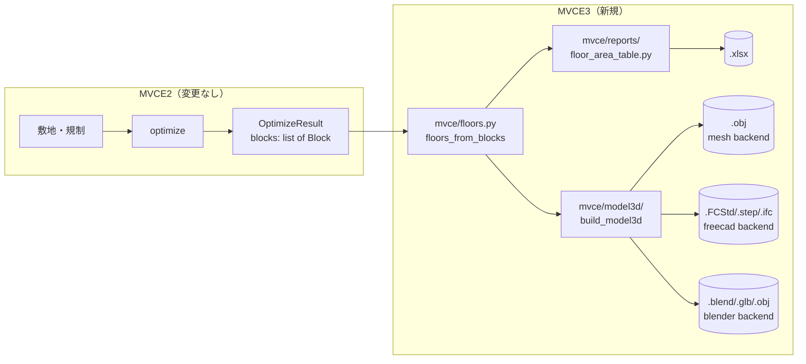

# MVCE3 基本設計書

| | |
|---|---|
| 版 | 0.1（初版） |
| 対象 | `mvce/floors.py`・`mvce/reports/`・`mvce/model3d/`（MVCE2の法規カーネルには変更なし） |
| 要件の根拠 | `mvce3_basic_spec.md`（基本仕様書） |
| 前提 | `docs/mvce/design_spec.md` 2.2節（モジュール構成）・3.6節（メッシュと結果） |

---

## 1. 全体構成

MVCE2の計算パイプライン（`design_spec.md` 5章）の**出口だけ**に手を加えます。
入口（敷地・規制の入力）から `OptimizeResult` が得られるまでは一切変更が
ありません。



`OptimizeResult.blocks`（`list[Block]`、`design_spec.md` 3.6節）が唯一の
入力です。`Block` は「平面形状 × 高さ範囲」（`mvce/massing.py`）で、
`solvers/optimizer.py` の `_floors_to_blocks` が必ず
`z_top - z_bottom == floor_height_m` の階単位で作っていることを
MVCE3全体の前提にしています（2.1節）。

## 2. モジュール構成

```
mvce/
  floors.py                 FloorSlab（階）とその組み立て          ★新規
  reports/
    __init__.py
    floor_area_table.py      各階床面積表のデータ構造とExcel出力    ★新規
  model3d/
    __init__.py              build_model3d()（バックエンド選択）    ★新規
    errors.py                Model3DBackendUnavailable
    solid.py                 耳切り法による三角形分割（穴なし）
    mesh_backend.py          既定バックエンド（OBJ、追加インストール不要）
    freecad_backend.py       FreeCADの Part モジュールで立体化
    blender_backend.py       Blenderの bpy でメッシュ化
  cli.py                     --floor-area-xlsx / --model3d-out / --model3d-backend を追加
  config.py                  OutputSettings に3フィールド追加
```

既存モジュール（`massing.py`・`solvers/optimizer.py`・`regulations/` 等）に
対する変更は**ありません**。

## 3. データモデル

### 3.1 `FloorSlab`（`mvce/floors.py`）

```python
FloorSlab(
    level: int,                  # 0始まりの階番号（0 = 1階）
    z_bottom: float,
    z_top: float,
    footprints: list[Polygon],   # 分棟なら複数
)
```

`floors_from_blocks(blocks, floor_height_m)` が `OptimizeResult.blocks` を
`level = round(z_bottom / floor_height_m)` でグループ化して作ります。
**新しい幾何演算は行いません** — `Block.footprint`（shapelyの `Polygon`、
`_floors_to_blocks` が階ごとに `union()` 済み）をそのまま束ねるだけです。

`area_m2` プロパティ（footprintsの面積の合計）と `has_holes` プロパティ
（いずれかのfootprintが内側リングを持つか）を持ちます。`has_holes` は
床面積表の備考欄（3.2節）と3Dモデル化（4章）の両方から参照します。

**丸めで階番号を求める理由**: `z_bottom` は浮動小数の演算結果なので、
`== level * floor_height_m` の一致比較は使えません。`round()` は
`_floors_to_blocks` が生成する値（誤差は浮動小数の丸め誤差程度）に対して
十分な安全マージンがあります。

### 3.2 `FloorAreaTable` / `FloorAreaRow`（`mvce/reports/floor_area_table.py`）

```python
FloorAreaRow(
    level: int, label_ja: str,             # "1階" 等
    z_bottom_m: float, z_top_m: float,
    area_m2: float, cumulative_area_m2: float,
    note: str,                              # "分棟あり" / "中抜きあり…"
)

FloorAreaTable(
    site_name: str,
    rows: list[FloorAreaRow],               # level昇順
    total_floor_area_m2: float,
    building_area_m2: float,                # 建築面積（最下階の面積で近似）
    site_area_m2: float,
    coverage_ratio_achieved: float | None,
    far_achieved: float,
    far_effective: float,
    notes: list[str],                       # 免責文 + OptimizeResult.notes
)
```

`build_floor_area_table(result: OptimizeResult) -> FloorAreaTable` が
組み立てを行います。`building_area_m2` は「最下階（level=0）の床面積」で
近似しています。`OptimizeResult.building_area_m2`（`massing.footprint_area`、
最下層の水平投影の**和集合**）と、後退がない限り一致しますが、
`_floors_to_blocks` は既に階ごとに `union()` 済みのため通常は一致します
（`tests/mvce/test_floor_area_table.py`
`test_building_area_matches_ground_floor`）。

`far_achieved` / `far_effective` は `OptimizeResult` の同名プロパティ
（`design_spec.md` 3.6節のOptimizeResultに準拠）をそのまま転記していて、
MVCE3側で再計算はしていません。

### 3.3 Excel（.xlsx）の構成

`write_floor_area_table_xlsx(table, path)` が `openpyxl` で1シート
（「各階床面積表」）を書きます。

| 行 | 内容 |
|---|---|
| 1 | 表題 |
| 2 | 敷地名 |
| 3 | 敷地面積 |
| 5 | ヘッダ（階／階高下端／階高上端／床面積／累計延床面積／備考） |
| 6〜 | 各階（**上階から下階の順**。確認申請の各階床面積表の慣例に合わせる） |
| （最終行） | 合計 |
| （末尾） | 建築面積・延床面積・容積率のまとめ、免責文 |

`openpyxl` はオプション依存（`pip install "jwcad-volume[xlsx]"` または
単に `pip install openpyxl`）です。未導入なら `write_floor_area_table_xlsx`
の呼び出し時に、原因と対処法を含む `ImportError` を送出します
（遅延import。`mesh`以外のCLI利用者に負担をかけないため）。

### 3.4 3Dモデル化バックエンドの抽象（`mvce/model3d/__init__.py`）

```python
def build_model3d(result: OptimizeResult, path: str, backend: str = "mesh") -> dict:
    ...
```

内部で `floors_from_blocks()` を呼んで `list[FloorSlab]` にしたあと、
`backend` に応じたモジュールへ**遅延import**で振り分けます。

```python
BACKENDS = ("mesh", "freecad", "blender")
```

戻り値の `dict` は `{"backend": ..., "floor_count": ...}` を共通で持ち、
バックエンドごとの追加統計（`vertex_count` 等）を含みます。CLI・呼び出し側は
これをそのまま利用者向けメッセージに使えます（`cli.py`）。

## 4. 3Dモデル化バックエンドの設計

### 4.1 共通方針

3つのバックエンドはすべて `list[FloorSlab]` を受け取り、それぞれの流儀で
「階の外周を階高ぶん押し出す」処理を行います。**指数関数的に複雑になる
形状の共有・合成（例えばBIMの壁・開口の相互関係）は扱いません** —
あくまでMVCE2の計算結果（階ごとのボリューム）をそのまま立体化するだけの
機能です。

どのバックエンドも、必要なライブラリが無ければ
`mvce.model3d.errors.Model3DBackendUnavailable`（`RuntimeError`）を
送出します。**黙って他のバックエンドにフォールバックすることはしません**
（`mvce3_basic_spec.md` の原則H）。利用者が明示的に選んだ手段が使えない
なら、そのことと対処法を伝えるほうが、気づかないまま別の形式で出力される
より安全という判断です。

### 4.2 `mesh` バックエンド（既定）— `mesh_backend.py` + `solid.py`

**追加インストールが不要な、このリポジトリで唯一実行・検証できる
バックエンドです。**

1. 各 `FloorSlab.footprints` の外周（`exterior`。内側の穴は無視 — 4.2.1節）
   を頂点列として取り出す
2. `solid.triangulate_simple_polygon()`（自前の耳切り法）で三角形分割する
3. 底面（`z_bottom`）・天端（`z_top`）にその三角形を配置し、外周に沿って
   側面の四角形（OBJでは四角形フェイスをそのまま書ける）を張る
4. Wavefront OBJ形式で書き出す

#### 4.2.1 耳切り法（ear clipping）を選んだ理由

`shapely.ops.triangulate` はドロネー三角形分割で、**凹多角形の外形をはみ
出したり、内部が欠けたりします**（凹型の建物配置はMVCE2でごく普通に
起こります）。3Dモデルの見た目のための三角形分割に数値解析的な性質は
不要なので、外部ライブラリに頼らない単純な耳切り法（`solid.py`）を
自前で実装しました。

**穴（内側リング）には対応していません。** 耳切り法を穴あり多角形に
拡張するには「穴を外周へブリッジする」処理が要り、実装・検証のコストが
このバックエンドの位置づけ（既定・最小構成のフォールバック）に見合わない
と判断しました。穴がある階は外周だけを描画し、`holes_ignored` に数えて
CLI・呼び出し側に注記を出します。**正確な穴の再現が要るなら `freecad`
バックエンドを使ってください**（4.3節）。

正しさの検証（`tests/mvce/test_model3d.py`）は、三角形分割した結果の
面積合計が元の多角形の面積（shapelyで計算した値）と一致することで
行っています。凸多角形・凹多角形（L字型）の両方で検証しています。

### 4.3 `freecad` バックエンド — `freecad_backend.py`

FreeCADの `Part` モジュールを使います。

1. 各 `footprint` の外周ワイヤと、内側リング（穴）があれば内側ワイヤも
   `Part.makePolygon()` で作る
2. `Part.Face([外周ワイヤ, *内側ワイヤ])` — **FreeCADは穴あき面を
   直接表現できる**ので、`mesh` バックエンドと違って穴を正確に扱えます
3. `face.extrude(Vector(0, 0, 階高))` で押し出し、`z_bottom` へ平行移動
4. `Part::Feature` としてドキュメントに追加、階ラベルを `Label` に設定
5. 拡張子に応じて `.FCStd`（`doc.saveAs`）・`.step`（`Part.export`）・
   `.ifc`（`importIFC.export`、FreeCADのImportワークベンチが要る）で保存

**FreeCADはpipパッケージではありません。** `import FreeCAD` が通るのは、
FreeCAD本体をインストールし、同梱のPython（`FreeCAD/bin/python` 等）から
実行したときだけです。通常のシステムPythonからは基本的に見えません。
そのため `_import_freecad()` は失敗を捕まえて、原因と対処法（本体の
インストール方法・実行に使うPythonの選び方）を含むメッセージで
`Model3DBackendUnavailable` を送出します。

> **検証状況**: このリポジトリの実行・テスト環境にはFreeCADが入って
> いません。上記の実装はFreeCADの公開Python APIの仕様（`Part.Face`・
> `extrude`・`Part.export`）に基づいていますが、**実際にFreeCADで実行して
> 動作を確認できていません。** 自動テストで検証できるのは
> 「FreeCADが無い環境で正しく `Model3DBackendUnavailable` になること」
> までです。FreeCADが使える環境で試して不具合があれば、この節と
> `freecad_backend.py` のdocstringを直してください。

### 4.4 `blender` バックエンド — `blender_backend.py`

Blenderの `bpy` を使います。

1. `solid.triangulate_simple_polygon()` で外周を三角形分割（`mesh`
   バックエンドと同じ耳切り法を再利用 — **`blender` バックエンドも
   穴には対応していません**、4.2.1節と同じ理由）
2. 底面・天端の三角形と側面の四角形フェイスを `bpy.data.meshes.new().
   from_pydata()` で1つのメッシュにする
3. 新しい `Collection`（MVCE3用）にリンクする
4. 拡張子に応じて `.blend`（`wm.save_as_mainfile`）・`.glb`/`.gltf`
   （`export_scene.gltf`）・`.obj`（Blenderのバージョンでオペレーター名が
   違う。`wm.obj_export` が無ければ `export_scene.obj` にフォールバック）
   で書き出す

**`bpy` は通常のpipパッケージではありません。** Blender本体に同梱の
Pythonから `blender --background --python <スクリプト>` の形で実行するか、
対応するBlenderバージョン・Python版・OSの組み合わせでのみ配布されている
`bpy` パッケージが要ります。`_import_bpy()` が失敗を捕まえて、実行方法を
含むメッセージで `Model3DBackendUnavailable` を送出します。

> **検証状況**: `freecad` バックエンドと同様、この環境にはBlender
> （`bpy`）が入っておらず、**実際にBlenderで実行して確認できていません。**
> 特にOBJ書き出しのオペレーター名はBlenderのバージョン（4.0で変更）に
> 依存するため、実行するバージョンで確認してください。

### 4.5 バックエンド比較のまとめ

| | `mesh`（既定） | `freecad` | `blender` |
|---|---|---|---|
| 追加インストール | 不要 | FreeCAD本体 | Blender本体（または対応する`bpy`） |
| この環境での検証 | 書き出しまで自動テスト済み | 未検証（API仕様どおりに実装） | 未検証（API仕様どおりに実装） |
| 中抜き（穴） | 非対応（外周のみ） | **対応** | 非対応（外周のみ） |
| 出力形式 | `.obj` | `.FCStd` / `.step` / `.ifc` | `.blend` / `.glb` / `.gltf` / `.obj` |
| 向いている用途 | とりあえず立体で見る・軽い確認 | BIM/CAD連携・IFC納品・穴のある平面 | パース・アニメーション・ゲームエンジン連携 |

## 5. インターフェース

### 5.1 設定YAML（`output:` に追加）

```yaml
output:
  # 既存のdxf_path・html_path等はそのまま
  floor_area_xlsx_path: 各階床面積表.xlsx   # 省略すると出力しない
  model3d_path: 建物.obj                    # 省略すると出力しない
  model3d_backend: mesh                     # mesh（既定） / freecad / blender
```

### 5.2 コマンドライン

```bash
mvce 設定.yaml \
  --floor-area-xlsx 各階床面積表.xlsx \
  --model3d-out 建物.obj --model3d-backend mesh
```

`--model3d-backend` に `freecad` / `blender` を指定してツールが無い場合、
`Model3DBackendUnavailable` の内容を標準エラーに出し、終了コード1で
終わります（既存の `_write_failed` と同じ形式に合わせています。
`mvce/cli.py`）。

## 6. テスト方針

| 対象 | 方法 |
|---|---|
| `FloorSlab` の組み立て（`floors.py`） | 単体の `Block` から期待どおりに階へグループ化されるか。`OptimizeResult` 経由の合計値との一致（`test_floors.py`） |
| 床面積表・Excel出力（`floor_area_table.py`） | `openpyxl` があるときだけ実行（`pytest.importorskip`）。行の並び・ヘッダ・合計値を検証（`test_floor_area_table.py`） |
| 耳切り法（`solid.py`） | 凸・凹（L字型）多角形で、三角形分割後の面積合計がshapelyの面積と一致すること、CW/CCWどちらの入力でも同じ結果になること（`test_model3d.py`） |
| `mesh` バックエンド | 実際にOBJを書き出し、頂点数・面の行数を手計算した期待値と照合。穴があるケースも別途検証 |
| `freecad`／`blender` バックエンド | ツールが無い環境で `Model3DBackendUnavailable` が送出されることだけを検証（`sys.modules` にロード済みでない前提。実機での検証は利用者側） |

`openpyxl` を使うテストは `pytest.importorskip("openpyxl")` で、未導入の
環境ではスキップします（CI環境によって `xlsx` エクストラが入っていない
場合の安全策）。

## 7. 制約と既知の限界（`mvce3_basic_spec.md` 4.4節・3.3節と対応）

1. 床面積表は法令上の「床面積」（令2条1項3号・4号）の不算入を反映しない
   近似値
2. `freecad`／`blender` バックエンドはこの開発環境で実行検証できていない
3. `mesh`／`blender` バックエンドは中抜き（穴）のある階を外周のみで描画する
4. 用途別内訳・意匠情報（窓・ドア・仕上げ）は持たない
5. 分棟（同一階に複数の独立した部分がある場合）は表・3Dモデルどちらも
   複数の要素として扱う（統合しない）

---

## 関連ドキュメント

| ファイル | 内容 |
|---|---|
| `mvce3_basic_spec.md` | **基本仕様書**（本文書の要件） |
| `design_spec.md` | MVCE2設計仕様書（法規カーネル） |
| `mvce2_log.md` | MVCE 2.0 実装ログ |
