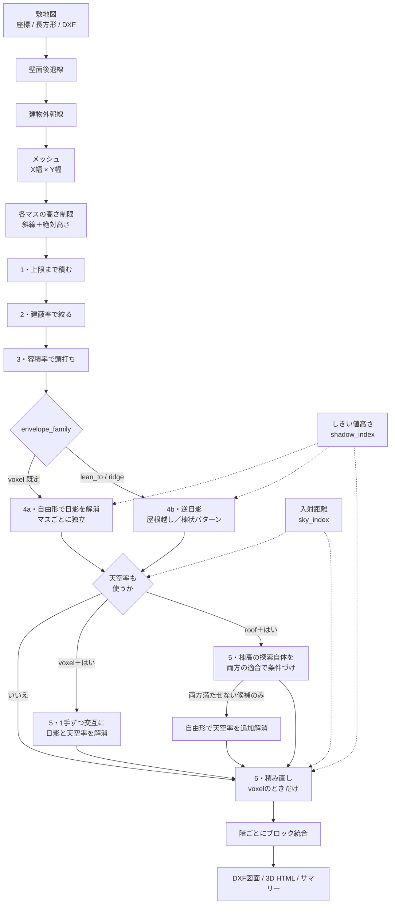

# MVE 設計仕様書

**MVE（Maximum Volume Engine）** — 日影規制・斜線制限・容積率をふまえて、
敷地に建てられる最大容積を求める計算エンジン。

| | |
|---|---|
| 版 | 2026-08 時点 |
| 対象 | `mve/` パッケージ（Python 3.9+）および `web/mve/`（ブラウザ版） |
| 規模 | Python 4,560行 / 28モジュール、JavaScript 1,380行 |
| 検証 | 自動テスト367件（うちMVE 201件）、DXF出力は実機JW-CADで表示確認済み |
| 位置づけ | **設計初期段階の検討用。確認申請には使えません**（`disclaimer.md`） |

---

## 1. 目的と非目標

### 1.1 解く問題

> 敷地の形・前面道路・用途地域・日影規制が与えられたとき、
> **法令を満たす範囲で延床面積が最大になる建物形状**を求める。

目標値は都市計画で定められた容積率です。前面道路12m未満による低減
（法52条1項・2項）を含めた「実際に使える容積率」に、どこまで近づけるかを
測ります。

### 1.2 設計上の中心的な判断

日影規制への対応を **「建物全体を一律に低くする」方式にしない**こと。
これが本エンジンの存在理由です。

一律に低くする方式は、日影に効いていない南側まで巻き添えで削るため、
容積を大きく取り逃します。MVEは敷地をメッシュに割り、**その測定点を実際に
日影にしているマスだけ**を特定して下げます。結果として、日影に効く方向の
マスだけが段状に低くなり、他は上限のまま残ります。

同一条件での比較（`tests/mve/test_optimizer.py`）:

| 方式 | 延床面積 |
|---|---|
| 一律に低くする（旧方式） | 478 m² |
| ボクセル法（MVE、自由形） | **1,144 m²** |

自由形（voxel）は容積が最大ですが、結果はマスごとにばらばらな階段状に
なります。**逆日影**（`envelope_family: lean_to | ridge`）は、代わりに
1〜2枚の勾配面で規則正しく後退させ、建築的に成立する量塊を返します
（5.4節）。容積は自由形よりやや少なくなりますが、そのまま検討図の
たたき台として使える形になります。

### 1.3 非目標

- **天空率の絶対値の算定** — 適合判定は行いますが（5.5節）、告示が定める
  厳密な投影法・測定点設置規則には準拠していません
- **等時間日影線の作図** — 測定点の等間隔サンプリングによる近似です
- **平均地盤面の算定**（令2条2項） — Z=0を地盤面としています
- **大域最適解** — 貪欲法です。「この条件ならこのくらいは入る」の下限の目安

---

## 2. システム構成

### 2.1 2つの実装

同じ計算を2系統で提供します。**同じ入力なら同じ結果になることを自動テストで
担保**しています（`tests/mve/test_js_parity.py`、Node.jsで実際にJS版を走らせて
Python版と突き合わせ）。

| | Python版 | ブラウザ版 |
|---|---|---|
| 実体 | `mve/` | `web/mve/`（単一HTMLに結合可） |
| 必要なもの | Python + shapely/numpy/ezdxf/PyYAML | ブラウザのみ |
| 入力 | YAML | フォーム |
| 出力 | DXF図面・3D HTML・サマリー | 平面図・3D・設定YAML |
| DXF入出力 | あり | なし |
| 天空率（法56条7項） | あり | **なし**（指定するとエラーになる） |
| 多角形演算 | shapely | 半平面クリップ（Sutherland–Hodgman） |

ブラウザ版で条件を詰めて設定YAMLを保存し、図面が必要になったらPython版に
渡す、という使い分けを想定しています。

> **凸でない敷地では差が出ることがあります。** ブラウザ版はライブラリを
> 持ち込まないため半平面クリップで代用しており、メッシュのマスが外郭線を
> はみ出す量の判定がわずかに変わります。厳密な数値が必要ならPython版を
> 使ってください。

### 2.2 モジュール構成

```
mve/
  site.py            敷地・境界線・緩和のデータモデル
  north.py           真北の基準（方位角⇔ベクトル変換）
  zoning.py          用途地域、別表第三/第四のテーブル
  far.py             容積率の算定（法52条1項・2項）
  solar.py           太陽位置（赤緯・高度・方位角）
  geometry.py        多角形ユーティリティ（辺別オフセット等）
  massing.py         建物ボリューム（Block = 平面形状 × 高さ範囲）
  mesh.py            壁面後退線 → 建物外郭線 → メッシュ
  shadow_index.py    日影のしきい値高さインデックス ★中核
  sky_index.py       天空率の入射距離インデックス   ★中核
  roof_envelope.py   逆日影（屋根越し・棟状パターン） ★中核
  optimizer.py       ボクセル貪欲最適化             ★中核
  regulations/
    road_slant.py      道路斜線（法56条1項1号、令130条の12/132/134/135の2）
    adjacent_slant.py  隣地斜線（法56条1項2号、令135条の3）
    north_slant.py     北側斜線（法56条1項3号、令135条の4）
    height_field.py    上記3つ＋絶対高さ制限の合成
    shadow.py          日影規制（法56条の2、令135条の12）
    sky_ratio.py       天空率（法56条7項、Ps/Pr の算定）
  io/
    dxf_site.py        DXF敷地図の読み込み
    dxf_r12.py         JW-CAD向けDXF R12ライター（既定）★
    dxf_pen.py         ezdxf経由のDXFライター（他CAD向け）
    drawing.py         図面の組み立て
    viewer3d.py        3Dビューア（単一HTML）
  config.py          設定YAMLの読み込み
  cli.py             コマンドライン
```

---

## 3. データモデル

### 3.1 敷地

```python
Site(
    points: list[Point],          # 頂点（反時計回り）
    edges: list[Boundary],        # edges[i] は points[i] → points[i+1]
    zoning: ZoningParams,
    north: NorthReference,
    floor_height_m: float = 3.2,
)
```

`edges[i]` は `points[i]` から `points[i+1]` への辺に対応します。この
1対1対応が、辺ごとの種別・幅員・後退距離をUIから指定できる根拠です。

### 3.2 境界線

```python
Boundary(
    p1, p2,
    kind: BoundaryKind,           # road | adjacent | none
    road_width_m: float,          # kind=road のとき必須（>0）
    wall_setback_m: float,        # 壁面後退距離
    relaxation: Relaxation,       # 外側の公園・水面・線路敷
    ground_level_diff_m: float,   # 正の値で「敷地の方が低い」
)
```

`wall_setback_m` は3か所に同時に効きます — 斜線制限の後退緩和、天空率の
検討、建物を置ける範囲の決定。設計上の基準線として一本化しています。

### 3.3 緩和対象

```python
Relaxation(kind: RelaxationKind, width_m: float)   # none | park | water | railway
```

**斜線の種類ごとに対象と扱いが違います。** ここは実装上の要注意点です。

| 規制 | 対象 | 扱い | 根拠 |
|---|---|---|---|
| 道路斜線 | 公園・広場・**水面** | 反対側境界線を対象物の反対側へ | 令134条 |
| 隣地斜線 | 公園・水面・**線路敷** | 幅の **1/2** だけ外側 | 令135条の3第1号 |
| 北側斜線 | **水面・線路敷のみ**（公園・広場は対象外） | 幅の **1/2** だけ外側 | 令135条の4第1項1号 |
| 日影 | 水面・線路敷・道路等 | みなし境界線（4.4節） | 令135条の12第3項 |

北側斜線で公園・広場が対象外である点は条文上の明確な差で、コード上も
別々の定数で表現しています。

```python
ROAD_RELAXATION_KINDS     = {PARK, WATER}
ADJACENT_RELAXATION_KINDS = {PARK, WATER, RAILWAY}
NORTH_RELAXATION_KINDS    = {WATER, RAILWAY}        # ← 公園を含まない
```

### 3.4 真北

```python
NorthReference(north_angle_deg: float)   # 図面の上(+Y)から反時計回りのずれ
```

北側斜線と日影計算はこの向きを基準に行います。方位角⇔ベクトルの変換を
一箇所に集約しているため、真北を回しても両方が整合して追従します。

### 3.5 日影規制

```python
ShadowRegulationSpec(
    measurement_height_m: float,     # 1.5 / 4.0 / 6.5 のいずれか（検証あり）
    line_5m_max_hours: float,        # 5m超10m以内の規制時間
    line_10m_max_hours: float,       # 10m超の規制時間
    latitude_deg: float = 35.7,
    hokkaido: bool = False,          # 真は9時〜15時
    time_step_minutes: float = 10.0,
    sample_interval_m: float = 2.0,
    apply_deemed_boundary: bool = True,
)
```

測定面と規制時間は**条例で決まる**ため、既定値を置かず必須入力にしています。
既定値で黙って計算が進むことを避けるための設計判断です。

構築時に2つの検証を行います。

- 測定面が 1.5 / 4.0 / 6.5 のいずれでもなければエラー
- `line_10m_max_hours > line_5m_max_hours` はエラー（別表第四では外側ほど短い）

### 3.6 メッシュと結果

```python
MeshCell(index, col, row, polygon, center, area_m2,
         height_limit_m, max_floors)      # 1マス = ボクセル1本の底面

BuildableArea(site, setback_ring, outline, cells,
              cell_size_x_m, cell_size_y_m, angle_deg)

OptimizeResult(site, area, floors, blocks, far, shadow_spec, shadow_lines,
               coverage_limited, far_limited, shadow_limited, sky_ratio_limited,
               volume_removed_by_shadow_m3, volume_removed_by_sky_ratio_m3,
               sky_ratio, roof_spec, notes)
```

`floors` はマスごとの階数を持つ整数配列で、**これが設計変数の全体**です。
最適化はこの1次元配列を操作するだけで完結します。

---

## 4. 法令対応表

### 4.1 高さ制限

| 条文 | 内容 | 実装 |
|---|---|---|
| 法56条1項1号 | 道路斜線 | `road_slant.height_limit_at` |
| 法56条1項2号 | 隣地斜線（20m+1.25 / 31m+2.5） | `adjacent_slant` |
| 法56条1項3号 | 北側斜線（5m / 10m + 1.25） | `north_slant` |
| 法55条 | 絶対高さ制限 | `zoning.absolute_height_limit_m` |
| 別表第三 | 適用距離・勾配 | `zoning.ROAD_SLANT_TABLE` |
| 令130条の12 | 道路斜線の後退緩和 | `road_slant`（後退分だけ反対側境界線を外へ） |
| 令132条 | 2以上の前面道路 | `road_slant.applied_width_at`（4.3節） |
| 令134条 | 公園・広場・水面（道路） | `ROAD_RELAXATION_KINDS` |
| 令135条の2 | 高低差緩和（道路） | `(差 - 1) / 2` |
| 令135条の3 | 隣地斜線の緩和 | 幅の1/2、高低差 `(差 - 1) / 2` |
| 令135条の4 | 北側斜線の緩和 | 水面・線路敷のみ1/2。**後退緩和なし** |

別表第三のテーブル（`ROAD_SLANT_TABLE`）:

```
住居系:  容積率≦200% → 20m/1.25    ≦300% → 25m/1.25
        ≦400% → 30m/1.25          超   → 35m/1.25
その他:  ≦400% → 20m/1.5           ≦600% → 25m/1.5
        ≦800% → 30m/1.5           ≦1000% → 35m/1.5
        ≦1100% → 40m/1.5          ≦1200% → 45m/1.5
        超    → 50m/1.5
```

北側斜線には**後退緩和がなく**、距離を**真北方向に測る**点が他の2つと
異なります。`_north_distance` が真北ベクトルへの射影で距離を出します。

### 4.2 容積率（法52条1項・2項）

前面道路の幅員が12m未満のとき、指定容積率と「幅員 × 低減係数」の小さい方。

```python
FAR_ROAD_COEFFICIENT = {"residential": 0.4, "other": 0.6}
FAR_ROAD_WIDTH_THRESHOLD_M = 12.0
```

前面道路が2以上ある場合は**最大幅員**で判定します。判定内容は `notes` に
日本語で残り、サマリーと図面に出力されます。

> **未対応:** 法52条9項（特定道路による緩和）、特定行政庁が定める割増。
> 該当し得る場合は `notes` に注意書きを出します。

### 4.3 令132条（2以上の前面道路）

条文は次の区域について「すべての前面道路が最大幅員の道路と同じ幅員を
有するものとみなす」としています。

```
(a) 幅員最大の前面道路の境界線から、その幅員の2倍以内 かつ 35m以内
(b) その他の前面道路の中心線から10mを超える区域
```

```python
MULTI_ROAD_WIDTH_FACTOR   = 2.0
MULTI_ROAD_MAX_DISTANCE_M = 35.0
MULTI_ROAD_CENTERLINE_M   = 10.0
```

**点ごとに** (a)(b) の該当を判定し、該当する点では各前面道路の幅員を最大幅員に
読み替えます。狭い道路に面していても条件を満たす範囲では広い道路の斜線で
判定できるため、実際に建てられる高さが上がります。判定の内訳は
`RoadSlantDetail` で確認できます。

> 3本以上で幅員がばらつく場合や屈曲した道路では、行政庁の運用が分かれる
> ことがあります。

### 4.4 日影規制（法56条の2、令135条の12）

冬至日の真太陽時8時〜16時（北海道9時〜15時）、測定面の水平面上で、
敷地境界線から5m・10mの範囲の日影時間を規制します。

**みなし境界線（令135条の12第3項）** — 敷地が道路・水面・線路敷等に接する
場合、境界線が外側にあるものとみなせます。

```python
DEEMED_BOUNDARY_WIDTH_THRESHOLD_M = 10.0
DEEMED_BOUNDARY_INSET_M = 5.0

幅 ≦ 10m  →  幅の 1/2 だけ外側
幅 >  10m  →  反対側の境界線から敷地側へ 5m の線
```

道路に接する敷地ではこの緩和で測定線がかなり外へ出るため、規制の実効的な
厳しさが大きく変わります。

**日影時間の判定** — 各時刻について、建物が測定面へ落とす影に測定点が入るかを
判定します。影の領域は「平面形状と影のずれベクトルのミンコフスキー和」ですが、
和集合を作らず次の同値関係で判定します。

```
点 P が影の中  ⟺  線分 [P - d, P] が平面形状と交わる      （d = 影のずれベクトル）
```

ブロックごとに独立に判定できるため、多角形の和集合演算が不要になります。

> **未対応:** 令135条の12第2項（日影の高低差緩和）。

---

## 5. 計算パイプライン



### 5.1 前処理：外郭線とメッシュ

壁面後退線は**辺ごとに異なる距離**でオフセットできる必要があるため、
半平面の交差として実装しています（`offset_polygon_by_edge_distances`）。

メッシュは既定で図面座標のXY軸に平行ですが、`mesh_angle_deg` を与えると
その角度に回した格子を作れます（道路に平行に割り付けたい場合）。実装は
外郭線を逆回転 → 軸平行に刻む → 戻す、という順序です。

マスの採用条件は `coverage_threshold`（既定0.5）で、**外郭線に入っている
面積の割合がこれ以上**のマスだけを使います。採用したマスは**外郭線で
切り取ります**。切らずに格子の矩形をそのまま使うと、端のマスが敷地の外へ
はみ出し、建物が敷地外に建って建築面積も過大に出ます。

各マスの高さ上限は、**4隅と中心の5点で最も厳しい値**を採用します。マス全体が
制限を満たすための安全側の取り方です。

### 5.2 ステップ1〜3：上限・建蔽率・容積率

| ステップ | 処理 |
|---|---|
| 1. 上限まで積む | 各マスに `max_floors` を入れる |
| 2. 建蔽率 | 上限超過時、**積める階数が多いマスを優先して残す** |
| 3. 容積率 | 延床上限を超えないよう上の階から削る |

ステップ2で「階数が多いマスを優先」するのが要点です。同じ建築面積でも、
高く積めるマスを残す方が容積を大きく取れます。

### 5.3 ステップ4a：日影規制の解消（自由形・既定）★中核

`shadow_index.py` が持つ**しきい値高さ**が、この処理を可能にします。

測定点 P、時刻 t、マス C を固定すると、「C が P に日影を落とすか」は
**C の高さだけ**の単調な条件になります。太陽高度を α、測定面高さを mh、
P から太陽方向へ伸ばした半直線が C に距離 r で入るとすると:

```
C が P を日影にする  ⟺  (h - mh) / tan(α) ≧ r
                     ⟺  h ≧ mh + r・tan(α)
```

そこで **しきい値高さ** を先に計算しておきます。

```
h_thresh(P, t, C) = mh + r・tan(α)
```

半直線がCを通らない場合は無限大（何m積んでも影を落とさない）。

`thresholds[測定線][点] = (時刻数 × マス数) の配列` という形で保持します。
半直線とマスの交差判定は、numpyのスラブ法（Ray-AABB）で一括計算します。

**この形にする利点は2つ。**

1. 高さを変えるたびに影の多角形を作り直す必要がなく、比較だけで済む
2. 超過した測定点について「**どのマスが効いているか**」を正確に特定でき、
   そのマスだけを下げるという設計判断ができる

解消の手順（`_resolve_shadow`）:

```
繰り返し:
  1. 最も超過している測定点を見つける（なければ終了）
  2. 解消すべき時刻数 need = ceil((現在の時間 - 規制時間) / 時間刻み)
  3. 各時刻について「その時刻の影を消すために失う体積」を計算
       各マスをしきい値をわずかに下回る階数まで下げたときの合計
  4. コストが安い時刻から need 個を選んで実際に下げる
```

**最も安い時刻から解消する**ため、失う容積が最小限に抑えられます。

### 5.4 ステップ4b：逆日影（屋根越し・棟状パターン）★中核

`envelope_family: "lean_to" | "ridge"` を指定したときの別解です（`roof_envelope.py`）。
自由形（4a）は容積を最大化しますが、結果はマスごとにばらばらな階段状に
なります。逆日影は代わりに**1〜2枚の勾配面**で建物の天端を規則正しく
段状に後退させ、片流れ（屋根越しパターン）・切妻（棟状パターン）に相当する
建築的な量塊を返します。

#### 棟の向き：日影の最厳しい方位にアンカーした探索

自由に探索すると計算量が爆発するうえ、敷地形状だけからは決め手がありません。
そこで、**日影規制を最も厳しくしている太陽方位**を先に特定し、その方位を
中心にした狭い範囲（既定 ±15°）だけを探索します。

1. 斜線制限・建蔽率・容積率までを適用した高さ配列で、最も規制超過が大きい
   測定点を求める（`ShadowIndex.worst`）。
2. その測定点を日影にしている時刻のうち、**解消に最も体積を要する時刻**の
   太陽方位角を「臨界方位」とする。
3. 測定点は太陽と反対側にあるので、屋根の低勾配側（測定点に面する側）が
   向く方位は `(臨界方位 + 180°) % 360`。
4. 棟の向きは、この値を中心に ±`roof_angle_span_deg` の範囲で探索する。

```
低勾配側が向く方位  =  (臨界方位 + 180°) % 360   ± 探索幅
```

#### 幾何：棟状パターンが一般形、屋根越しパターンはその特殊形

棟（稜線）と、それに直交する「低勾配側の方位」ベクトル `n` を使い、
マス中心 `c` の高さ上限を次の式で求めます（`s` は棟からの符号付き距離）。

```
s = (c - 棟上の点) · n
height_cap(c) = 棟高 - tan(pitch_near)・max(s, 0)         （s ≧ 0：低勾配側）
              = 棟高 - tan(pitch_far)・max(-s, 0)          （s < 0：反対側）
                （pitch_far = 0 なら反対側は無制限＝元の高さ制限のまま）
```

屋根越しパターン（片流れ）は、棟を外郭線の外側まで押し出し、**全マスが
低勾配側になった特殊形**として実装します。同じ計算式を使うため、2つの
パターンで結果の比較がそのまま公平にできます（棟状パターンは屋根越し
パターンを包含するので、`ridge` の容積は `lean_to` 以上になります）。

#### 探索と検証

方位・棟位置・両側の勾配は小さな候補集合を総当たりし、各候補について
**棟高だけを二分探索**します（棟を下げるほど各マスの高さ上限が単調に下がる
ので、日影の適合状態も単調に改善する、という性質を使っています）。

候補の中から延床面積が最大のものを採用し、`compute_shadow_hours`
（shapely を使う独立実装）で必ず再検証します。天空率で行った検証と同じ
考え方です（`tests/mve/test_roof_envelope.py`）。

積み直し（5.7節）は行いません。個別に積み直すと、せっかくの規則正しい
形が崩れてしまうためです。

### 5.5 天空率の解消（単独のとき） ★中核

`_resolve_sky_ratio`。日影規制が無い場合、または日影と同時に扱わない
場合に、**すべての測定点で Ps ≧ Pr を満たすまで下げます**。内部は
1手ずつ進める `_sky_step` の繰り返しで、この最小単位を5.6節の同時最適化
でも使い回します。

`sky_index.py` は日影と同じ形のインデックスを持ちます。測定点 P、方位 φ、
マス C を固定すると、P から φ 方向へ伸ばした半直線が C に入るまでの距離 r は
**マスの高さによらず一定**です。

```
C が方位 φ で作る仰角 = atan2(h_C - z0, r(P, φ, C))
その方位の稜線        = マスについての最大値
天空率 Ps             = Σ 0.5・cos²(仰角)・dφ / π × 100     （正射影）
```

Pr（適合建築物の天空率）は形が変わらないので、構築時に1回だけ計算して
保持します。

#### マス単位で見ても定義どおりの値になる

`sky_ratio.sky_ratio_percent` は階ごとに結合したブロックを見ますが、マス
ごとに見た最大値と**厳密に一致**します。

- ブロック側の最大値は、各階層について「その階に達している最も近いマス」で決まる
- マス側の最大値を与えるマス c\* は、階層 k = floors[c\*] − 1 で同じ値を作れる

両方向の不等式が成り立つため一致します。`tests/mve/test_sky_ratio.py` が
3つのメッシュ幅について、インデックスと多角形版の一致を検証しています。

#### 解消の手順（`_resolve_sky_ratio`）

```
繰り返し:
  1. Pr - Ps が最大の測定点を見つける（なければ終了）
  2. その点の稜線を作っているマスを列挙する（ridge_cells）
  3. 各候補を1階下げたときの「天空率の改善 / 失う体積」を計算
  4. 最も効率のよいマスを1階下げる
```

稜線に含まれないマスは、いくら下げてもその測定点の天空率を変えません。
これも `test_sky_ratio.py` で検証しています。

#### 方位のサンプリングをずらす理由

方位を刻み幅の半分だけずらします（`AZIMUTH_OFFSET_RATIO = 0.5`）。
0/90/180/270度ちょうどだと、軸に平行なメッシュの面に**沿って走る**光線が
生じ、境界線上の測定点で「面をかすめただけ」が当たり判定になって天空率が
跳ねます。ずらすとこの縮退が起きません。Ps と Pr は同じ方位で比較します。

### 5.6 日影と天空率の同時最適化

`use_sky_ratio: true` かつ日影規制も有効な場合、5.3〜5.5節を順番に
解ききるのではなく、**同時に**動かします。片方を先に解消し切ってから
他方に移ると、一方の是正がもう一方も満たしていたことに気づけず、
削り込みが重複することがあるためです。

安全に交互進行できる根拠は、日影・天空率どちらのインデックスも
**マスの高さを下げる方向にしか動かさない限り単調に改善する**という
性質です（5.3節・5.5節）。片方の1手がもう片方を悪化させることはないので、
どちらの順で1手ずつ進めても最終的な適合状態は変わりません。

#### voxel（自由形）：1手ずつ交互に解消

`_resolve_shadow_and_sky_jointly` が実体です。`_resolve_shadow` /
`_resolve_sky_ratio` それぞれの内部を「最も安い1手だけ進める」
`_shadow_step` / `_sky_step` に分割し、

```
繰り返し:
  1. 日影が残っていれば _shadow_step を1回
  2. 天空率が残っていれば _sky_step を1回
  3. どちらも完了したら終了
```

と交互に呼び出します。次の1手を選ぶときには常に**両方の最新の状態**を
見て判断できるので、従来の「日影を全部解消してから天空率を全部解消する」
2段階方式より削り込みが少なくなる場合があります。

#### lean_to / ridge（逆日影）：棟の探索そのものに両方を条件づける

`search_roof_envelope` に `sky_index` を渡すと、棟高の二分探索
（5.4節）が**日影と天空率の両方**を満たすかどうかを条件にします。
候補（方位・棟位置・両側の勾配）ごとに、両方が適合する棟高を二分探索で
求め、その中で延床面積が最大のものを採用します（`RoofSearchResult.
sky_ratio_included=True`）。

離散的な候補の中に両方を満たす組み合わせが1つも無い場合は、日影だけを
満たす棟形状に戻し（`sky_ratio_included=False`）、天空率の是正は
`optimizer.py` 側が自由形の `_resolve_sky_ratio` で別途行います。
規則正しい形が崩れる代償を払ってでも、まず適合させることを優先する
設計判断です。

**トレードオフの実例**（`tests/mve/test_joint_optimization.py`）: ある
条件で比較すると、棟高そのものに両方を条件づけた同時探索は延床
1,110 m²、屋根形状はいったん日影だけで決めて天空率は自由形パッチで
後から削ると1,119 m²と、**自由形パッチの方が僅かに広くなることが
あります**。マス単位で自由に削れる分だけ効率がよいためです。それでも
MVEは同時探索が成功する限りそちらを採用します。屋根が規則正しい1〜2枚の
勾配面のままであること（4b節の目的）を、僅かな容積差より優先するという
一貫した設計判断です。同時探索が失敗したときだけ自由形パッチにフォール
バックします。

### 5.7 ステップ6：積み直し

日影で削った結果、容積率に余地が空くことがあります。日影に効いていない
マス（南側など）は削る必要がなかったのに、ステップ3の容積率で低く抑えられて
いる場合があるためです。

上限・建蔽率・容積率・日影のすべてを満たす範囲で、面積の大きいマスから
1階ずつ戻します（`_refill`）。逆日影（lean_to / ridge）では行いません
（5.4節）。

### 5.8 出力：ブロックへの統合

`floors` 配列をそのまま出力すると、マスの数だけ多角形ができて図面も3Dも
重くなります。**同じ階に存在するマスを1つの多角形に結合**し、ブロック数を
階数分に抑えます（`_floors_to_blocks`）。

---

## 6. 制約と既知の限界

### 6.1 アルゴリズム

貪欲法であり、**大域最適解ではありません**。結果はメッシュの粗さに依存
します。`--cell` を細かくすると容積が増える傾向がありますが、計算時間も
増えます。

延床面積は `総体積 / 階高` で算定しています。ブロックごとに階数を丸めると
薄い層が0階と数えられ、実態より少なく出るためです。

### 6.2 精度

- 天空率・日影とも測定点は等間隔サンプリングによる近似
- 平均地盤面を算定しておらず Z=0 を地盤面としている（傾斜地で乖離）
- 等時間日影線そのものは作図していない

### 6.3 天空率の適合は保証されるが、絶対値は認定ソフトと異なる

`use_sky_ratio: true` は斜線制限を外し、**代わりに全測定点で Ps ≧ Pr を確認
して満たすまで下げます**（5.5節）。適合しない形状が結果として返ることは
ありません。適合しきれない場合は `sky_ratio_ok` が偽になり、サマリーと
`notes` に理由が出ます。

ただし**天空図の投影方法と測定点の配置は内部で一貫した近似**（正射影・
境界線上の等間隔配置）であり、告示が定める厳密な測定点設置規則には準拠して
いません。Ps と Pr を同じ方法・同じ方位で比較しているので相対比較の一貫性は
ありますが、**天空率の絶対値を認定ソフトの数値と突き合わせる用途には
使えません**。

ブラウザ版は天空率に未対応です。`useSkyRatio` を渡すと、未検証の結果を
返さないよう明示的にエラーにします。

### 6.4 未対応の条文

| 条文 | 内容 |
|---|---|
| 法52条9項 | 特定道路による容積率の緩和 |
| 令135条の12第2項 | 日影の高低差緩和 |
| 令2条2項 | 平均地盤面の算定 |
| 令132条 | 3本以上が複雑に絡む場合の運用差 |

---

## 7. 出力仕様

### 7.1 DXF図面

**JW-CADが読める形式で書き出します。実機のJW-CADで表示を確認済み（2026-08）。**

| 条件 | 理由 |
|---|---|
| **DXF R12（AC1009）** | R2000以降はJW-CADが解釈できない |
| **LINE と TEXT のみ** | `LWPOLYLINE` はR14以降の要素で読み飛ばされる |
| **座標はmm**（1m = 1000単位） | JW-CADはmmで作図する |
| **テーブル名は大文字** | `CONTINUOUS` / `STANDARD` |
| **ハンドルを付けない** | グループコード5。R12では省略可 |
| **テーブルは3つだけ** | `LTYPE` / `LAYER` / `STYLE` |
| **CRLF・Shift-JIS** | `$DWGCODEPAGE=ANSI_932` |

これらのどれを外しても、**読み込みは成功したように見えて図面に何も
表示されません**。ezdxf が書くR12は下4つを満たさないため表示されない
ことを実機で確認しています。既定のライターは外部ライブラリを使わず
1バイトずつ組み立てます（`dxf_r12.py`）。

レイヤ19枚でも表示されました。JW-CADのレイヤ上限（1グループ16枚）は
DXF読込の可否には影響しません。

| レイヤ | 内容 |
|---|---|
| `MVE-SITE` | 敷地境界線・日影の規制境界線 |
| `MVE-ROAD` | 前面道路（幅員ぶんの帯・幅員の文字） |
| `MVE-SETBACK` | 壁面後退線 |
| `MVE-OUTLINE` | 建物外郭線 |
| `MVE-MESH` | メッシュの割り付け |
| `MVE-FLOORS` | 各マスの階数（文字） |
| `MVE-PLAN-n` | n階の平面輪郭 |
| `MVE-SHADOW-5M` / `-10M` | 日影の測定線 |
| `MVE-NORTH` | 真北記号 |
| `MVE-RIDGE` | 逆日影（屋根越し・棟状パターン）の棟の位置 |
| `MVE-SUMMARY` | 計算結果の要約（日本語） |

他のCAD向けには `--dxf-backend ezdxf` で ezdxf 版を選べます。

### 7.2 3Dビューア

単一HTML。外部ライブラリもCDNも使わずCanvas 2Dで描画（ペインターズ
アルゴリズム＋背面カリング）。最大ボリューム（オレンジ）と斜線制限の
エンベロープ（青の半透明）を重ねて表示します。

### 7.3 サマリー

```
敷地面積: 600.0 m2
建築面積: 360.0 m2（建蔽率の上限 360.0 m2）
延床面積(概算): 1144.0 m2（容積率の上限 1200.0 m2）
達成容積率: 191%（上限 200% に対して 95%）
最高高さ: 22.40 m
体積: 3660.8 m3
メッシュ: 2.0m × 2.0m / 使用90マス（全150マス）/ 最高7階
上限に達した規制: 建蔽率・容積率・日影規制
　日影規制で削った体積: 870.4 m3
　5m〜10mの測定線（5.0時間以内）: 適合 / 最大 5.00時間
　10m超の測定線（3.0時間以内）: 適合 / 最大 3.00時間
法52条2項: 前面道路の最大幅員6.0m × 0.4 = 240%（指定容積率 200%）
```

**どの規制が効いて頭打ちになったか**を必ず示します。容積が伸びない理由が
分からないまま終わらせないための出力設計です。

---

## 8. インターフェース

### 8.1 設定YAML

```yaml
site:
  name: 敷地名
  # 形状は3通りのいずれか
  rectangle: {width_m: 30, depth_m: 20}
  # points: [[0,0], [30,0], [30,20], [0,20]]
  # dxf: {path: 敷地図.dxf, units_per_meter: 1000}

  north_angle_deg: 0          # 真北のずれ（反時計回り）
  wall_setback_m: 0           # 全辺の既定値

  edges:                      # points と同数・同順
    - {kind: road, road_width_m: 6.0}
    - {kind: adjacent}
    - {kind: adjacent, relaxation: {kind: water, width_m: 4.0}}
    - {kind: adjacent, ground_level_diff_m: 1.5}

  zoning:
    zone_type: 1res           # 13種＋unspecified
    far_ratio: 200            # %でも比でも可
    coverage_ratio: 60
    # absolute_height_limit_m: 10

  floor_height_m: 3.2

shadow:                       # 対象区域外なら丸ごと省略
  measurement_height_m: 4.0   # 1.5 / 4.0 / 6.5
  line_5m_max_hours: 5.0
  line_10m_max_hours: 3.0
  latitude_deg: 35.7
  hokkaido: false
  # time_step_minutes: 10.0
  # sample_interval_m: 2.0
  # apply_deemed_boundary: true

mesh:
  cell_size_x_m: 3.0
  cell_size_y_m: 3.0
  # mesh_angle_deg: 0
  # coverage_threshold: 0.5
  # use_sky_ratio: false      # true で斜線制限に代えて天空率で判定（5.5節）
  # sky_ratio_interval_m: 4.0 # 天空率の測定点の間隔(m)
  # sky_ratio_n_azimuth: 72   # 天空を何方位で刻むか
  # envelope_family: voxel    # voxel（既定）/ lean_to（屋根越し）/ ridge（棟状。5.4節）
  # roof_angle_span_deg: 15.0 # 棟の向きを探索する範囲（臨界方位を中心に±この角度）
  # roof_fixed_low_azimuth_deg: null   # 棟の向きを固定したい場合に指定
  # max_iterations: 4000

output:
  dxf_path: 結果.dxf
  html_path: 結果_3d.html
  # draw_mesh: true
  # draw_floor_labels: true
  # dxf_units_per_meter: 1000
  # dxf_backend: r12          # r12 | ezdxf
```

> **Windowsのパスを `" "` で囲まないでください。** YAMLの二重引用符では
> `\U` がユニコードのエスケープとして解釈され、読み込みに失敗します。

### 8.2 コマンドライン

```bash
mve 設定.yaml [--dxf-out 図面.dxf] [--html-out 3d.html]
              [--cell 2.0] [--no-shadow]
              [--dxf-units 1000] [--dxf-backend r12|ezdxf]
```

Windowsでは `MVE実行.bat` のダブルクリックで、Python検出・依存導入・
テンプレート生成・実行まで自動で行います。

---

## 9. 検証

### 9.1 自動テスト（367件）

| 対象 | 件数 | 内容 |
|---|---|---|
| `test_slant_lines.py` | 26 | 3斜線と全緩和。法令の基準値で検証 |
| `test_optimizer.py` | 25 | 貪欲最適化。旧方式・逆日影との比較を含む |
| `test_io.py` | 25 | DXF入出力（棟の描画を含む）・3D・設定読み込み |
| `test_js_parity.py` | 22 | **Node.jsでJS版を実行しPython版と突き合わせ** |
| `test_shadow.py` | 20 | 日影時間・みなし境界線・測定面 |
| `test_jww_dxf_compat.py` | 15 | DXF書式の固定（再発防止） |
| `test_sky_ratio.py` | 14 | 天空率の接続。独立計算での適合検証を含む |
| `test_roof_envelope.py` | 13 | **逆日影（屋根越し・棟状パターン）。独立計算での適合検証を含む** |
| `test_web_ui.py` | 10 | Chromiumで実際に操作 |
| `test_joint_optimization.py` | 9 | **日影と天空率の同時最適化。voxelの交互解消・逆日影の同時探索の両方を検証** |
| `test_north.py` | 8 | 真北の方位角変換 |
| `test_cli_output_paths.py` | 7 | 出力先・エラー処理 |
| `test_far.py` | 7 | 法52条2項 |

斜線制限・日影の計算式は、**法令の基準値**に対する単体テストで検証して
います（道路斜線1.25/1.5勾配、隣地斜線20m+1.25・31m+2.5、北側斜線
5m/10m+1.25、冬至の太陽高度など）。

### 9.2 JS版との一致

`test_js_parity.py` が実際にNode.jsでJS版を走らせ、太陽位置・法52条2項・
斜線制限（令132条の複数道路・各種緩和・高低差・真北の回転を含む）・日影の
みなし境界線・メッシュ・**各マスの階数**・延床面積・サマリー文字列まで
突き合わせます。

### 9.3 実機検証の状況

| 項目 | 状況 |
|---|---|
| DXF読込（JW-CAD） | **確認済み（2026-08）** |
| ブラウザ版UI | Chromiumで自動テスト |
| Windows exe ビルド | **未検証**（開発環境がLinuxのため） |
| 外部変形（JWC形式） | **未検証**。`jwcad_volume` 側の機能 |

---

## 10. 今後の課題

1. **天空率・逆日影をブラウザ版へ移植する** — 現在はPython版のみ
2. **JWW外部変形をMVEへ載せ替える** — `jwcad_volume` が旧エンジンのまま
3. **Windows exe の実機検証**
4. **実務者のノウハウ・過去のボリュームチェック図面を学習するモジュール**
   （次段階の構想として合意済み。まだ設計に着手していない）
5. 令135条の12第2項（日影の高低差緩和）
6. 法52条9項（特定道路による緩和）
7. 平均地盤面の算定（傾斜地対応）

**完了済み:** 逆日影と天空率の同時最適化（5.6節）— voxelは1手ずつの
交互解消、lean_to/ridgeは棟高の探索自体を両方の適合で条件づける方式で
実装済み。

---

## 関連ドキュメント

| ファイル | 内容 |
|---|---|
| `README.md` | 使い方 |
| `manual.md` | **取扱説明書**（操作手順・敷地データの作り方・結果の読み方） |
| `web_ui.md` | ブラウザ版UIとPython版との一致検証 |
| `legal_basis.md` | 条文と実装の対応、緩和対象の違い |
| `methodology.md` | ボクセル最適化の考え方、旧方式との比較 |
| `disclaimer.md` | 免責事項と未対応項目 |
| `../jww_integration.md` | JW-CADへの取り込み、DXF書式の詳細 |
