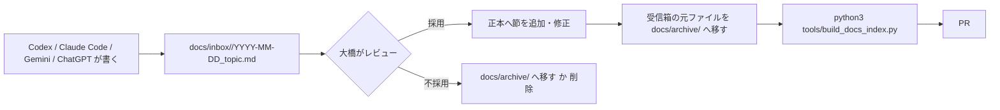

# 文書の整理・統合ルール（Obsidian + AI エージェント）

> WorldSim／SiteInfo の md は、このリポジトリを **Obsidian の vault** として開いて
> 読み書きし、Codex・Claude Code・Gemini・ChatGPT が書いた文書は **受信箱 →
> レビュー → 正本へ統合** の一方通行で取り込みます。正本は常に Git にある md で、
> Obsidian は閲覧・編集・リンク確認の道具です。

## 1. 何をどこに置くか

| 場所 | 役割 | 書くのは誰 |
|---|---|---|
| `docs/INDEX.md` | 索引（Map of Content）。`tools/build_docs_index.py` が生成 | スクリプト |
| `docs/worldsim/` | WorldSim／SiteInfo の **正本**（構想、要件、定義書、設計、実装指示） | 大橋、レビュー済みのエージェント PR |
| `docs/mve/`、`docs/*.md` | MVE と JW-CAD 版の正本 | 同上 |
| `docs/inbox/<tool>/` | エージェントや ChatGPT が書いた **未統合** の md | Codex、Claude Code、Gemini、ChatGPT からの貼り付け |
| `docs/archive/` | 統合済み・古い版。索引には載るが参照しない | 統合した人 |
| `AGENTS.md`、`CLAUDE.md`、`GEMINI.md` | 各ツールが最初に読む案内。**3 つは同じ内容** | 大橋 |

正本は 1 テーマ 1 ファイル。同じテーマの md を 2 つ作らず、既存の正本に節を足します。
正本の一覧と読む順番は [`../../AGENTS.md`](../../AGENTS.md) にあります。

## 2. ファイルの書き方（3 ツール共通）

- 先頭に frontmatter を置く。Obsidian のプロパティとして表示され、索引にも使われる。

  ```yaml
  ---
  summary: 1 行の要約（索引の「内容」列に出る）
  status: draft | stable | generated | inbox | archived
  owner: 大橋
  updated: 2026-09-20
  sources: ChatGPT 会話 2026-09-18, reinfolib API 仕様   # 任意。出典
  ---
  ```

- 見出し 1（`# ...`）を 1 つだけ置く。frontmatter に `title` が無ければこれが索引のタイトルになる。
- リンクは **相対パスの Markdown リンク** `[表示名](siteinfo_db_design.md#4-主要な設計判断)`。
  `[[wikilink]]` は GitHub で描画されず、エージェントが辿れないので使わない
  （`.obsidian/app.json` で Markdown リンクを既定にしてある）。
- 画像・PDF は同じフォルダの `assets/` に置き、`` で参照する。
- 法令の条文番号や数値は一次情報を確認して出典を書く（[`../mve/legal_basis.md`](../mve/legal_basis.md) の流儀）。
- 未決事項は「未決」節にまとめ、決まったら「決定」と日付を書き、本文へ反映する
  （[`siteinfo_field_definitions.md`](siteinfo_field_definitions.md) の §5.1 と §13 が例）。

## 3. AI が書いた md を統合する流れ



1. **書く**: エージェントは正本を直接書き換えず、`docs/inbox/<tool>/YYYY-MM-DD_topic.md`
   に置く。`<tool>` は `codex` / `claude` / `gemini` / `chatgpt`。frontmatter は
   `status: inbox`、`sources:` に元になった会話や資料を書く。
   例外は、大橋が「正本を直す」と依頼した PR（この場合は正本を直接編集してよい）。
2. **レビュー**: 大橋が Obsidian で受信箱を開き、採用する部分を決める。
3. **統合**: 採用部分を正本の該当節へ移す。文体・用語は正本に合わせ、出典は残す。
   同じ内容が 2 か所に残らないようにする。統合はエージェントに頼んでよい
   （依頼文のひな形は [`siteinfo_agent_prompts.md`](siteinfo_agent_prompts.md)）。
4. **片付け**: 受信箱の元ファイルは `docs/archive/` に移し、frontmatter を
   `status: archived` にして、先頭に「→ 統合先:」と統合先への相対リンクを書く。
5. **索引**: `python3 tools/build_docs_index.py` を実行し、`docs/INDEX.md` と
   リンク切れの有無を確認してから PR にする。`pytest tests/test_docs_index.py` が
   同じ検査をする。

## 4. Obsidian の設定

- vault はリポジトリのルートを開く（`docs/` だけを開くと `AGENTS.md` や
  `db/siteinfo/schema.sql` へのリンクが切れる）。
- `.obsidian/app.json` はコミットしてある（Markdown リンク、相対パス、
  コード用フォルダを検索から除外）。`workspace*.json` などの個人設定は
  `.gitignore` で除外。
- 同期は Git で行う（Obsidian Sync は使わない）。スマホでは GitHub の md 表示で
  読み、編集は PC で行う。
- 推奨プラグイン（任意）: Dataview（`status: inbox` の一覧を作る）、
  Git（vault 内からコミット）。無くても運用できる。

Dataview を使う場合、受信箱の一覧は次のクエリで出る。

```dataview
TABLE summary, updated FROM "docs/inbox" WHERE status = "inbox" SORT updated DESC
```

## 5. 各ツールの使い分け

| ツール | 向いていること | 入口 |
|---|---|---|
| Codex | 実装（API、アダプタ、テスト）。PR 単位 | `AGENTS.md` |
| Claude Code | 設計書の作成・統合、SQL の検証、レビュー。PR 単位 | `CLAUDE.md` |
| Gemini | 長い資料や PDF の要約、法令・GIS 資料の読み込み。結果は受信箱へ | `GEMINI.md` |
| ChatGPT | 会話での構想整理。要点を md にして受信箱へ貼る | — |

どのツールも、正本を変える PR では **`docs/INDEX.md` を再生成し、リンク切れ 0**
にしてから出す。3 つの案内ファイルは同じ内容に保つ（`tests/test_docs_index.py` で検査）。
