# SiteInfo データベース構造図・PostGIS テーブル設計 v0.2（草案）

> [`siteinfo_field_definitions.md`](siteinfo_field_definitions.md)（項目定義書）を
> PostgreSQL／PostGIS のテーブルに落としたものです。DDL は
> [`../../db/siteinfo/schema.sql`](../../db/siteinfo/schema.sql)。

## 1. 設計方針

1. **敷地 1 件 = `site` 1 行**。位置・形状・面積・方位など、下流エンジンが
   必ず使う値は `site` に列として持つ。
2. **繰り返す情報は子テーブル**。境界辺（`site_edge`）、法令制限
   （`site_legal_restriction`）、添付（`site_attachment`）は 1 対多。
3. **項目ごとの取得元と確認状態は `site_field_provenance` に持つ**。
   値の列を増やしても provenance の構造は変わらない。必須項目の確認が
   揃ったかどうかは、このテーブルを集計して判定する。
4. **項目定義書そのものを `field_definition` テーブルに入れる**。画面の
   必須表示、自動入力の候補、確定条件の判定をデータで駆動する。
5. **コード表はカタログテーブル**（`zone_type_catalog`、
   `legal_restriction_catalog`、`gis_source`）。法令の追加はデータの追加で済ませ、
   スキーマを変えない。
6. **座標系**: 保存は JGD2011 経緯度（EPSG:6668）。面積・距離・MVE 連携は
   `site.plane_srid` の平面直角座標系（EPSG:6669〜6687）に `ST_Transform`
   して計算する。
7. **監査**: `site` の変更は `site_history` に旧行を丸ごと残す（トリガ）。
   確定後の変更は新しい版として扱う。

## 2. 構造図（ER 図）

```mermaid
erDiagram
    site ||--o{ site_edge : "境界辺"
    site ||--o| site_zoning : "都市計画・形態規制"
    site ||--o{ site_zone_part : "用途地域の分割"
    site ||--o| site_shadow_regulation : "日影規制"
    site ||--o{ site_legal_restriction : "法令上の制限"
    site ||--o| site_utility : "供給施設"
    site ||--o| site_market : "市場・立地"
    site ||--o{ site_attachment : "添付資料"
    site ||--o{ site_field_provenance : "項目ごとの取得元・確認"
    site ||--o{ site_history : "変更履歴"
    field_definition ||--o{ site_field_provenance : "項目キー"
    legal_restriction_catalog ||--o{ site_legal_restriction : "法令コード"
    zone_type_catalog ||--o{ site_zoning : "用途地域コード"
    gis_source ||--o{ site_field_provenance : "取得元"

    site {
        uuid site_id PK
        text site_name
        text address
        text municipality_code
        jsonb lot_numbers
        geometry geom "MultiPolygon, 6668"
        int plane_srid
        numeric north_angle_deg
        numeric area_registered_m2
        numeric area_measured_m2
        numeric area_geom_m2 "生成列"
        numeric area_effective_m2
        text area_basis
        text status "draft/confirmed/archived"
    }
    site_edge {
        uuid site_id FK
        int edge_seq PK
        text edge_kind "road/adjacent/none"
        numeric road_width_m
        text road_type
        boolean is_private_road
        numeric wall_setback_m
        text relaxation_kind
        numeric relaxation_width_m
        geometry geom "LineString, 6668"
    }
    site_zoning {
        uuid site_id PK
        text area_division
        text zone_type FK "過半の用途地域"
        boolean zoning_split
        numeric far_percent "按分値は小数"
        numeric bcr_percent
        text fire_zone
        text height_district
        text district_plan
        jsonb planned_road
        numeric absolute_height_limit_m
    }
    site_zone_part {
        uuid site_id FK
        int part_seq PK
        text zone_type FK
        geometry geom "MultiPolygon, 6668"
        numeric far_percent
        numeric bcr_percent
        text trace_source
    }
    site_shadow_regulation {
        uuid site_id PK
        text shadow_applies "regulated/none/unknown"
        numeric measurement_height_m
        numeric hours_5m
        numeric hours_10m
        text target_criteria
        boolean hokkaido
    }
    site_legal_restriction {
        uuid site_id FK
        text law_code FK
        text applies "yes/no/unknown"
        text detail
        text reference
    }
    site_field_provenance {
        uuid site_id FK
        text field_key FK
        text source_kind "auto/manual/derived"
        uuid gis_source_id FK
        timestamptz source_fetched_at
        text confirm_status "unconfirmed/confirmed/rejected"
        text confirmed_by
        timestamptz confirmed_at
    }
    field_definition {
        text field_key PK
        text group_code
        text label_ja
        text data_type
        text unit
        text required "required/recommended/optional"
        text auto_fill "established/varies/none"
        text law_reference
    }
    legal_restriction_catalog {
        text law_code PK
        text law_name_ja
        text typical_zones
        text auto_fill
    }
    zone_type_catalog {
        text zone_type PK
        text label_ja
        text mve_code
    }
    gis_source {
        uuid gis_source_id PK
        text name
        text provider
        text municipality_code
        text url
        text license
    }
```



## 3. テーブル一覧

| テーブル | 役割 | 対応する定義書の節 |
|---|---|---|
| `site` | 敷地の本体。所在、形状、面積、方位、確定状態 | 1, 2, 3 |
| `site_edge` | 境界辺ごとの種別、道路幅員、道路種別、緩和対象 | 4 |
| `site_zoning` | 都市計画法・建築基準法の指定値と形態規制フラグ | 5, 6 |
| `site_zone_part` | 用途地域が 2 以上にまたがる場合の部分ごとのポリゴンと指定値 | 5.1 |
| `site_shadow_regulation` | 日影規制の条例値 | 7 |
| `site_legal_restriction` | 重要事項説明書の法令制限（法令ごとに 1 行） | 8 |
| `site_utility` | 供給施設、既存建物の記録 | 9 |
| `site_market` | 最寄駅、徒歩分、地価 | 10 |
| `site_attachment` | 添付資料（測量図、公図、GeoJSON） | 11 |
| `site_field_provenance` | 項目ごとの取得元と確認状態 | 0.3 |
| `site_history` | `site` 行の変更履歴 | — |
| `field_definition` | 項目定義書（辞書） | 全体 |
| `legal_restriction_catalog` | 法令コード表 | 8.1 |
| `zone_type_catalog` | 用途地域コード表（MVE コードとの対応） | 5 |
| `gis_source` | 自動入力に使う GIS 取得元の登録 | 0.4 |

## 4. 主要な設計判断

### 4.1 provenance を別テーブルにする理由

各値の列に `_source` `_confirmed` を並べると、列数が 3 倍になり、確定条件の
判定 SQL が項目追加のたびに変わります。`site_field_provenance` に
`(site_id, field_key)` で 1 行持てば、確定条件は次の 1 本で済みます。

```sql
-- 未確認の必須項目が残っている敷地
select s.site_id, d.field_key
from site s
join field_definition d on d.required = 'required'
left join site_field_provenance p
  on p.site_id = s.site_id and p.field_key = d.field_key
where p.confirm_status is distinct from 'confirmed';
```

### 4.2 法令制限を行で持つ理由

重要事項説明書の法令は 20 を超え、今後も増えます。列で持つと法令追加が
スキーマ変更になるため、`legal_restriction_catalog` に法令を登録し、敷地
ごとに `site_legal_restriction` に行を作ります。`applies = 'unknown'` の行が
残っていれば確定できません。

### 4.3 面積を 4 つ持つ理由

公簿・実測・図形の 3 つは出典が違い、どれを採用するかは案件ごとに判断
します。`area_effective_m2` と `area_basis` に採用値と根拠を残し、下流には
採用値だけを渡します。`area_geom_m2` は `geom` からの生成列で、手で書き換え
られません。

### 4.4 用途地域の分割を行で持つ理由

敷地が 2 以上の用途地域にまたがる場合、部分ごとにポリゴンと指定値を持たないと
面積按分ができません。`site_zone_part` に部分を行で持ち、
`site_zone_part_areas()` が部分の面積と割合を、`site_zoning_from_parts()` が
「過半の用途地域」「面積按分した容積率・建蔽率」「覆率」を返します。
`site_zoning.zoning_split = true` の敷地は、この導出値と `site_zoning` の値が
一致し、覆率が 1 ± 0.01 に収まるまで確定できません（`site_can_confirm()`）。

### 4.5 座標系

- `geom` は EPSG:6668（JGD2011 経緯度）。全国の敷地を 1 つの SRID で扱える。
- `plane_srid` は敷地の位置から自動判定（系 I〜XIX）。MVE に渡す座標は
  `ST_Transform(geom, plane_srid)` で得た平面座標（m）。
- 面積は `ST_Area(ST_Transform(geom, plane_srid))` で計算する。
  `geography` 型の楕円体面積との差は敷地規模では無視できるが、
  MVE と同じ平面で計算して値を揃える。

## 5. MVE へのマッピング

| MVE（YAML） | SiteInfo |
|---|---|
| `site.points` | `ST_Transform(site.geom, plane_srid)` の外周座標（反時計回り） |
| `site.north_angle_deg` | `site.north_angle_deg` |
| `site.wall_setback_m` | `site_edge.wall_setback_m`（全辺同値なら 1 つ） |
| `site.edges[].kind` / `road_width_m` / `relaxation` | `site_edge` の各行 |
| `zoning.zone_type` | `zone_type_catalog.mve_code`（分割ありなら過半の用途地域） |
| `zoning.far_ratio` / `coverage_ratio` | `site_zoning.far_percent` / `bcr_percent`（分割ありなら面積按分値） |
| （将来）部分ごとの斜線・日影 | `site_zone_part` の部分ポリゴンと用途地域。MVE が部分ごとの適用に対応したら渡す |
| `zoning.absolute_height_limit_m` | `site_zoning.absolute_height_limit_m` |
| `shadow.measurement_height_m` | `site_shadow_regulation.measurement_height_m` |
| `shadow.line_5m_max_hours` / `line_10m_max_hours` | `hours_5m` / `hours_10m` |
| `shadow.hokkaido` | `hokkaido` |
| `shadow.latitude_deg` | `ST_Y(ST_Centroid(site.geom))` |

## 6. 次の作業

1. `schema.sql` を PostGIS 環境で流して、サンプル敷地（`sample_site.geojson`）を
   投入する `seed` を作る。
2. `field_definition` の初期データを項目定義書から生成するスクリプトを作る。
3. Codex 向け実装指示書（API、GeoJSON 入出力、確定判定）。
4. 入力・確認画面の設計（自動入力値と手入力値の見分け、確認ボタン）。
